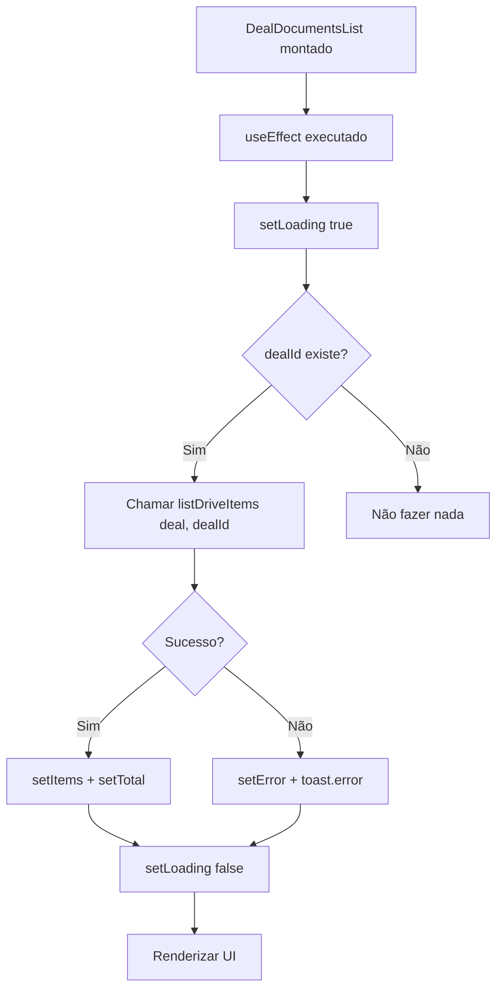

# Documentação: Aba de Documentos na Deal Detail Page

## Visão Geral

Esta documentação descreve a implementação da aba "Documentos" na página de detalhes do negócio (Deal Detail Page), que utiliza o `driveClient.ts` para listar e exibir documentos associados a um negócio.

## Arquitetura

### Componentes Principais

1. **DealDetailPage** (`src/features/deals/pages/DealDetailPage.tsx`)
   - Página principal de detalhes do negócio
   - Contém a estrutura de abas (Players, Docs, Atividades)
   - Renderiza o componente `DealDocumentsList` na aba "Docs"

2. **DealDocumentsList** (`src/features/deals/components/DealDocumentsList.tsx`)
   - Componente responsável por listar documentos de um negócio
   - Utiliza `driveClient.listDriveItems("deal", dealId)` para buscar documentos
   - Exibe os documentos em formato de tabela

3. **driveClient** (`src/lib/driveClient.ts`)
   - Cliente HTTP para comunicação com a API do Drive
   - Suporta consultas baseadas em entidade (entity-based queries)
   - Função principal: `listDriveItems(entityType, entityId)`

## Implementação Detalhada

### 1. Extensão do driveClient

O `driveClient.ts` foi estendido para suportar dois tipos de consultas:

#### Consulta por Pasta (Folder-based)
```typescript
// Lista itens de uma pasta específica
const items = await listDriveItems('folder-id-123')
```

#### Consulta por Entidade (Entity-based)
```typescript
// Lista itens associados a uma entidade
const items = await listDriveItems('deal', 'deal-id-123')
```

**Assinatura da Função:**
```typescript
export async function listDriveItems(
  folderIdOrEntityType?: string,
  entityId?: string | number,
  page: number = 1,
  limit: number = 50
): Promise<ListDriveItemsResponse>
```

**Parâmetros:**
- `folderIdOrEntityType`: ID da pasta OU tipo de entidade ('deal', 'lead', 'company', etc.)
- `entityId`: ID da entidade (obrigatório quando o primeiro parâmetro é um tipo de entidade)
- `page`: Número da página para paginação (padrão: 1)
- `limit`: Número de itens por página (padrão: 50)

**Retorno:**
```typescript
interface ListDriveItemsResponse {
  items: DriveItem[];
  total: number;
}

interface DriveItem {
  id: string;
  name: string;
  type: 'file' | 'folder';
  size?: number;
  createdAt: string;
  updatedAt?: string;
  parentId?: string;
  url?: string;
  permission?: 'read' | 'write' | 'admin';
}
```

### 2. Componente DealDocumentsList

O componente foi criado para fornecer uma visualização simples e direta dos documentos.

**Características:**
- ✅ Carregamento automático ao montar
- ✅ Estados de loading, error e empty
- ✅ Exibição em tabela com colunas: Tipo, Nome, Tamanho, Data de Criação
- ✅ Diferenciação visual entre arquivos e pastas
- ✅ Formatação adequada de tamanhos (KB, MB, etc.)
- ✅ Formatação de datas no padrão brasileiro
- ✅ Tratamento de erros com mensagens amigáveis

**Props:**
```typescript
interface DealDocumentsListProps {
  dealId: string  // ID do negócio
}
```

**Estados:**
```typescript
const [items, setItems] = useState<DriveItem[]>([])      // Lista de itens
const [loading, setLoading] = useState(true)              // Estado de carregamento
const [error, setError] = useState<string | null>(null)   // Mensagem de erro
const [total, setTotal] = useState(0)                     // Total de itens
```

### 3. Integração na DealDetailPage

A aba "Docs" foi atualizada para usar o novo componente:

```tsx
<TabsContent value="documents">
  <DealDocumentsList dealId={deal.id} />
</TabsContent>
```

## Fluxo de Carregamento



## UI/UX

### UI Screenshots e Mockups

#### Exemplo Visual - Tabela de Documentos

```
╔══════════════════════════════════════════════════════════════════╗
║  Documentos                                         [3 itens] ▼  ║
╠══════════════════════════════════════════════════════════════════╣
║                                                                  ║
║  ┌────────────────────────────────────────────────────────────┐ ║
║  │ Tipo │ Nome                     │ Tamanho │ Data Criação   │ ║
║  ├──────┼──────────────────────────┼─────────┼────────────────┤ ║
║  │  📄  │ Proposta Comercial.pdf   │ 1.5 MB  │ 15/01/2024    │ ║
║  │      │ ⚪ Arquivo               │         │                │ ║
║  ├──────┼──────────────────────────┼─────────┼────────────────┤ ║
║  │  📁  │ Contratos                │    —    │ 10/01/2024    │ ║
║  │      │ ⚪ Pasta                 │         │                │ ║
║  ├──────┼──────────────────────────┼─────────┼────────────────┤ ║
║  │  📄  │ Termos.docx              │ 256 KB  │ 08/01/2024    │ ║
║  │      │ ⚪ Arquivo               │         │                │ ║
║  └────────────────────────────────────────────────────────────┘ ║
║                                                                  ║
╚══════════════════════════════════════════════════════════════════╝
```

#### Estado de Loading

```
╔══════════════════════════════════════════════════════════════════╗
║  Documentos                                                      ║
╠══════════════════════════════════════════════════════════════════╣
║                                                                  ║
║  ┌────────────────────────────────────────────────────────────┐ ║
║  │  ░░░░  ░░░░░░░░░░░░░░░░░░░░░░░  ░░░░░░░  ░░░░░░░░░░░░    │ ║
║  │  ░░░░  ░░░░░░░░░░░░░░░░░░░░░░░  ░░░░░░░  ░░░░░░░░░░░░    │ ║
║  │  ░░░░  ░░░░░░░░░░░░░░░░░░░░░░░  ░░░░░░░  ░░░░░░░░░░░░    │ ║
║  │  ░░░░  ░░░░░░░░░░░░░░░░░░░░░░░  ░░░░░░░  ░░░░░░░░░░░░    │ ║
║  │  ░░░░  ░░░░░░░░░░░░░░░░░░░░░░░  ░░░░░░░  ░░░░░░░░░░░░    │ ║
║  └────────────────────────────────────────────────────────────┘ ║
║                                                                  ║
╚══════════════════════════════════════════════════════════════════╝
```

#### Estado Vazio

```
╔══════════════════════════════════════════════════════════════════╗
║  Documentos                                                      ║
╠══════════════════════════════════════════════════════════════════╣
║                                                                  ║
║                            📄                                    ║
║                                                                  ║
║                Nenhum documento encontrado                       ║
║                    para este negócio.                           ║
║                                                                  ║
╚══════════════════════════════════════════════════════════════════╝
```

#### Estado de Erro

```
╔══════════════════════════════════════════════════════════════════╗
║  Documentos                                                      ║
╠══════════════════════════════════════════════════════════════════╣
║                                                                  ║
║                            ⚠️                                    ║
║                                                                  ║
║              Drive API URL not configured                        ║
║                                                                  ║
║      Verifique se a API do Drive está configurada              ║
║                    corretamente.                                ║
║                                                                  ║
╚══════════════════════════════════════════════════════════════════╝
```

### Estados da Interface

#### 1. Estado de Carregamento (Loading)
- **Quando:** Dados estão sendo buscados
- **Exibição:** Skeleton loaders (5 linhas pulsando)
- **Componentes:** Card com título "Documentos" + Skeletons

#### 2. Estado Vazio (Empty)
- **Quando:** Nenhum documento encontrado (total = 0)
- **Exibição:** 
  - Ícone de arquivo centralizado
  - Mensagem: "Nenhum documento encontrado para este negócio."
- **Componentes:** Card com ícone e texto centralizados

#### 3. Estado de Erro (Error)
- **Quando:** Falha ao carregar documentos
- **Exibição:**
  - Mensagem de erro específica
  - Texto auxiliar: "Verifique se a API do Drive está configurada corretamente."
  - Toast de erro
- **Componentes:** Card com mensagem de erro

#### 4. Estado com Dados (Success)
- **Quando:** Documentos carregados com sucesso
- **Exibição:** Tabela com documentos
- **Componentes:** 
  - Card com título "Documentos"
  - Badge com contador de itens
  - Tabela responsiva

### Layout da Tabela

| Coluna | Largura | Conteúdo | Exemplo |
|--------|---------|----------|---------|
| **Tipo** | 50px | Ícone (📁 pasta / 📄 arquivo) | [Ícone azul] |
| **Nome** | Flex | Nome + Badge de tipo | "Contrato.pdf" + Badge "Arquivo" |
| **Tamanho** | 120px | Tamanho formatado ou "—" | "1.5 MB" ou "—" |
| **Data de Criação** | 180px | Data formatada | "15/01/2024" |

### Elementos Visuais

#### Ícones
- **Arquivo:** Ícone `FileText` em azul (`text-blue-500`)
- **Pasta:** Ícone `Folder` preenchido em amarelo (`text-yellow-500`, `weight="fill"`)

#### Badges
- **Contador de itens:** Badge secundário no cabeçalho
  - Singular: "1 item"
  - Plural: "2 itens"
- **Tipo de item:** Badge outline em cada linha
  - "Arquivo" para files
  - "Pasta" para folders

#### Cores e Estilos
- Borda da tabela: `rounded-md border`
- Hover nas linhas: `hover:bg-muted/50`
- Texto secundário: `text-muted-foreground`
- Fonte média: `font-medium` para nomes

## Exemplo de Uso

### Chamada da Função
```typescript
// No componente DealDocumentsList
const response = await listDriveItems('deal', dealId)
```

### Resposta da API (Exemplo)
```json
{
  "items": [
    {
      "id": "doc-001",
      "name": "Proposta Comercial.pdf",
      "type": "file",
      "size": 2048576,
      "createdAt": "2024-01-15T10:30:00Z",
      "url": "https://drive.example.com/files/doc-001"
    },
    {
      "id": "folder-001",
      "name": "Contratos",
      "type": "folder",
      "createdAt": "2024-01-10T14:00:00Z"
    }
  ],
  "total": 2
}
```

### Renderização
```
┌─────────────────────────────────────────────────────────┐
│ Documentos                                    [2 itens] │
├─────────────────────────────────────────────────────────┤
│ ┌────────────────────────────────────────────────────┐ │
│ │ Tipo │ Nome                   │ Tamanho │ Data     │ │
│ ├──────┼────────────────────────┼─────────┼──────────┤ │
│ │ 📄   │ Proposta Comercial.pdf │ 2 MB    │15/01/2024│ │
│ │      │ [Arquivo]              │         │          │ │
│ ├──────┼────────────────────────┼─────────┼──────────┤ │
│ │ 📁   │ Contratos              │ —       │10/01/2024│ │
│ │      │ [Pasta]                │         │          │ │
│ └────────────────────────────────────────────────────┘ │
└─────────────────────────────────────────────────────────┘
```

## Testes

### Cobertura de Testes

#### driveClient.test.ts
- ✅ Listagem básica de itens
- ✅ Listagem com folderId
- ✅ Listagem com entityType e entityId
- ✅ Paginação
- ✅ Tratamento de erros (401, 403, 404, 500)
- ✅ Validação de autenticação
- ✅ Total: 23 testes

#### DealDocumentsList.test.tsx
- ✅ Estado de loading
- ✅ Estado vazio
- ✅ Listagem com sucesso
- ✅ Exibição de badges de tipo
- ✅ Exibição de tamanhos
- ✅ Tratamento de erros
- ✅ Formatação de datas
- ✅ Contador singular/plural
- ✅ Total: 8 testes

**Total Geral:** 31 testes passando ✅

### Executar Testes

```bash
# Testar driveClient
npm run test:run tests/unit/lib/driveClient.test.ts

# Testar DealDocumentsList
npm run test:run tests/unit/features/deals/DealDocumentsList.test.tsx

# Testar tudo
npm run test:run
```

## Configuração Necessária

### Variáveis de Ambiente

```env
# .env ou .env.local
VITE_DRIVE_API_URL=https://seu-backend.onrender.com
```

**Importante:** Sem esta variável configurada, o componente exibirá uma mensagem de erro informando que a API não está configurada.

### Requisitos da API Backend

O backend deve implementar o endpoint:

```
GET /api/drive/items?entityType={type}&entityId={id}&page={page}&limit={limit}
```

**Headers esperados:**
- `Authorization: Bearer {token}` - Token do Supabase

**Resposta esperada:**
```json
{
  "items": [
    {
      "id": "string",
      "name": "string",
      "type": "file" | "folder",
      "size": number,
      "createdAt": "string (ISO 8601)",
      "updatedAt": "string (ISO 8601)",
      "url": "string"
    }
  ],
  "total": number
}
```

## Navegação

### Localização na Interface

1. Acessar página de Negócios: `/deals`
2. Clicar em um negócio específico
3. Na página de detalhes: `/deals/{id}`
4. Clicar na aba "**Docs**" (segunda aba, ícone de documento)

### Breadcrumbs

```
Negócios > [Empresa] > [Nome do Cliente] > Docs (aba ativa)
```

## Melhorias Futuras

Possíveis extensões da funcionalidade:

- [x] Upload de novos documentos
- [x] Criação de pastas
- [ ] Ações inline (download, visualizar, excluir)
- [ ] Navegação em subpastas
- [ ] Busca/filtro de documentos
- [ ] Ordenação de colunas
- [ ] Preview de documentos (imagens, PDFs)
- [ ] Compartilhamento de links
- [ ] Gestão de permissões
- [ ] Integração com DocumentManager para funcionalidades avançadas

## Interações de Escrita

### Visão Geral

A partir da versão 1.1.0, o componente `DealDocumentsList` suporta operações de escrita, permitindo que os usuários criem pastas e façam upload de arquivos diretamente na aba de documentos.

### Funcionalidades

#### 1. Criar Pasta

**Acesso:** Botão "Criar Pasta" no cabeçalho da seção de documentos

**Fluxo:**
1. Usuário clica no botão "Criar Pasta"
2. Modal simples é exibido solicitando o nome da pasta
3. Usuário informa o nome e clica em "Criar Pasta"
4. Sistema chama `createDriveFolderForEntity("deal", deal.id, name)`
5. Ao completar com sucesso:
   - Toast de sucesso é exibido
   - Modal é fechado
   - Lista de documentos é recarregada via `listDriveItems("deal", deal.id)`

**Estados:**

- **Normal:** Modal fechado, botão habilitado
- **Modal Aberto:** Campo de texto para nome da pasta, botões Cancelar e Criar Pasta
- **Criando:** Botão mostra "Criando...", campo desabilitado durante criação
- **Sucesso:** Toast verde com mensagem "Pasta '{nome}' criada com sucesso"
- **Erro:** Toast vermelho com mensagem de erro específica

**Exemplo Visual - Modal de Criar Pasta:**

```
╔════════════════════════════════════════════════════════╗
║  Criar Nova Pasta                                  [X] ║
╠════════════════════════════════════════════════════════╣
║                                                        ║
║  Informe o nome da pasta que deseja criar no Drive.  ║
║                                                        ║
║  ┌────────────────────────────────────────────────┐  ║
║  │ Nome da Pasta                                  │  ║
║  │ ┌────────────────────────────────────────────┐ │  ║
║  │ │ Ex: Contratos, Propostas...                │ │  ║
║  │ └────────────────────────────────────────────┘ │  ║
║  └────────────────────────────────────────────────┘  ║
║                                                        ║
║                              [Cancelar] [Criar Pasta] ║
╚════════════════════════════════════════════════════════╝
```

**Validações:**
- Nome da pasta não pode estar vazio
- Botão "Criar Pasta" desabilitado se campo vazio
- Enter no campo de texto aciona a criação

#### 2. Upload de Arquivo

**Acesso:** Botão "Upload" no cabeçalho da seção de documentos

**Fluxo:**
1. Usuário clica no botão "Upload"
2. Modal é exibido com seletor de arquivos
3. Usuário seleciona um arquivo
4. Preview do arquivo selecionado é mostrado (nome e tamanho)
5. Usuário clica em "Upload"
6. Sistema chama `uploadDriveFileForEntity("deal", deal.id, file)`
7. Ao completar com sucesso:
   - Toast de sucesso é exibido
   - Modal é fechado
   - Lista de documentos é recarregada via `listDriveItems("deal", deal.id)`

**Estados:**

- **Normal:** Modal fechado, botão habilitado
- **Modal Aberto:** Seletor de arquivo, botões Cancelar e Upload
- **Arquivo Selecionado:** Preview mostrando nome e tamanho do arquivo
- **Enviando:** Botão mostra "Enviando...", seletor desabilitado durante upload
- **Sucesso:** Toast verde com mensagem "Arquivo '{nome}' enviado com sucesso"
- **Erro:** Toast vermelho com mensagem de erro específica

**Exemplo Visual - Modal de Upload:**

```
╔════════════════════════════════════════════════════════╗
║  Upload de Arquivo                                 [X] ║
╠════════════════════════════════════════════════════════╣
║                                                        ║
║  Selecione um arquivo para fazer upload no Drive.     ║
║                                                        ║
║  ┌────────────────────────────────────────────────┐  ║
║  │ Arquivo                                        │  ║
║  │ ┌────────────────────────────────────────────┐ │  ║
║  │ │ [Escolher arquivo]  proposta.pdf           │ │  ║
║  │ └────────────────────────────────────────────┘ │  ║
║  │                                                │  ║
║  │ Arquivo selecionado: proposta.pdf (1.5 MB)    │  ║
║  └────────────────────────────────────────────────┘  ║
║                                                        ║
║                                  [Cancelar] [Upload]  ║
╚════════════════════════════════════════════════════════╝
```

**Validações:**
- Arquivo deve ser selecionado para habilitar botão Upload
- Botão "Upload" desabilitado se nenhum arquivo selecionado
- Todos os tipos de arquivo são aceitos

### Código de Exemplo

#### Criar Pasta

```typescript
const handleCreateFolder = async () => {
  if (!folderName.trim()) {
    toast.error('Por favor, informe o nome da pasta')
    return
  }

  setCreatingFolder(true)
  try {
    await createDriveFolderForEntity('deal', dealId, folderName)
    toast.success(`Pasta "${folderName}" criada com sucesso`)
    setCreateFolderOpen(false)
    setFolderName('')
    // Reload the list after successful creation
    await loadDocuments()
  } catch (err) {
    const errorMessage = err instanceof Error ? err.message : 'Erro ao criar pasta'
    toast.error(errorMessage)
    console.error('[DealDocumentsList] Error creating folder:', err)
  } finally {
    setCreatingFolder(false)
  }
}
```

#### Upload de Arquivo

```typescript
const handleUploadFile = async () => {
  if (!selectedFile) {
    toast.error('Por favor, selecione um arquivo')
    return
  }

  setUploading(true)
  try {
    await uploadDriveFileForEntity('deal', dealId, selectedFile)
    toast.success(`Arquivo "${selectedFile.name}" enviado com sucesso`)
    setUploadOpen(false)
    setSelectedFile(null)
    // Reload the list after successful upload
    await loadDocuments()
  } catch (err) {
    const errorMessage = err instanceof Error ? err.message : 'Erro ao fazer upload do arquivo'
    toast.error(errorMessage)
    console.error('[DealDocumentsList] Error uploading file:', err)
  } finally {
    setUploading(false)
  }
}
```

### Exemplos de Estados de Sucesso

#### Sucesso ao Criar Pasta

**Interface:**
- Modal fecha automaticamente
- Toast verde aparece no canto superior direito
- Mensagem: "Pasta 'Contratos' criada com sucesso"
- Lista de documentos atualiza mostrando a nova pasta
- Nova linha aparece na tabela com ícone de pasta amarelo

**Console:**
```
[DriveClient] createDriveFolderForEntity success: { folder: { id: '...', name: 'Contratos', ... } }
[DealDocumentsList] Folder created successfully, reloading documents
[DriveClient] listDriveItems success: { items: [...], total: 4 }
```

#### Sucesso ao Fazer Upload

**Interface:**
- Modal fecha automaticamente
- Toast verde aparece no canto superior direito
- Mensagem: "Arquivo 'proposta.pdf' enviado com sucesso"
- Lista de documentos atualiza mostrando o novo arquivo
- Nova linha aparece na tabela com ícone de arquivo azul

**Console:**
```
[DriveClient] uploadDriveFileForEntity success: { file: { id: '...', name: 'proposta.pdf', size: 1572864, ... } }
[DealDocumentsList] File uploaded successfully, reloading documents
[DriveClient] listDriveItems success: { items: [...], total: 5 }
```

### Exemplos de Estados de Erro

#### Erro ao Criar Pasta - Nome Duplicado

**Interface:**
- Modal permanece aberto
- Toast vermelho aparece
- Mensagem: "Failed to create folder for deal: 409 Folder with this name already exists"
- Campo de texto mantém o valor digitado
- Botão volta ao estado normal ("Criar Pasta")

**Console:**
```
[DriveClient] createDriveFolderForEntity error: DriveApiError: Failed to create folder for deal: 409 Folder with this name already exists
[DealDocumentsList] Error creating folder: DriveApiError: Failed to create folder for deal: 409 Folder with this name already exists
```

#### Erro ao Fazer Upload - Arquivo Muito Grande

**Interface:**
- Modal permanece aberto
- Toast vermelho aparece
- Mensagem: "Failed to upload file for deal: 413 File too large (max 50MB)"
- Arquivo selecionado permanece visível
- Botão volta ao estado normal ("Upload")

**Console:**
```
[DriveClient] uploadDriveFileForEntity error: DriveApiError: Failed to upload file for deal: 413 File too large (max 50MB)
[DealDocumentsList] Error uploading file: DriveApiError: Failed to upload file for deal: 413 File too large (max 50MB)
```

#### Erro de Autenticação

**Interface:**
- Modal permanece aberto
- Toast vermelho aparece
- Mensagem: "No authentication token available. Please sign in."
- Sugere ao usuário fazer login novamente

**Console:**
```
[DriveClient] Error getting session: No active session
[DriveClient] createDriveFolderForEntity error: Error: No authentication token available. Please sign in.
```

#### Erro de Rede / API Indisponível

**Interface:**
- Modal permanece aberto
- Toast vermelho aparece
- Mensagem: "Drive API URL not configured. Please set VITE_DRIVE_API_URL environment variable."
- Sugere verificação de configuração

**Console:**
```
[DriveClient] Error: Drive API URL not configured
[DealDocumentsList] Error creating folder: Error: Drive API URL not configured. Please set VITE_DRIVE_API_URL environment variable.
```

### Tratamento de Erros

Todos os erros são capturados e tratados de forma consistente:

1. **Erro é capturado** no bloco try-catch
2. **Mensagem é extraída** do erro (se for uma instância de Error)
3. **Toast de erro** é exibido com mensagem específica
4. **Console.error** registra o erro completo para debug
5. **Estado da UI** retorna ao normal (botões habilitados, loading false)
6. **Modal permanece aberto** para permitir correção

### API Backend Esperada

#### Criar Pasta

```
POST /api/drive/folders
Content-Type: application/json
Authorization: Bearer {token}

Body:
{
  "name": "Contratos",
  "entityType": "deal",
  "entityId": "deal-123"
}

Response (201 Created):
{
  "folder": {
    "id": "folder-abc",
    "name": "Contratos",
    "parentId": null,
    "createdAt": "2024-12-06T20:00:00Z",
    "permission": "write"
  }
}
```

#### Upload de Arquivo

```
POST /api/drive/files
Content-Type: multipart/form-data
Authorization: Bearer {token}

Form Data:
- file: [binary file data]
- entityType: "deal"
- entityId: "deal-123"

Response (201 Created):
{
  "file": {
    "id": "file-xyz",
    "name": "proposta.pdf",
    "size": 1572864,
    "mimeType": "application/pdf",
    "url": "https://drive.google.com/file/d/...",
    "createdAt": "2024-12-06T20:05:00Z",
    "permission": "write"
  }
}
```

### Diferenças: DealDocumentsList vs DocumentManager (Atualizado)

| Característica | DealDocumentsList | DocumentManager |
|----------------|-------------------|-----------------|
| Complexidade | Simples | Completa |
| API Utilizada | driveClient.ts | useDriveDocuments hook |
| Upload | ✅ Sim (v1.1.0+) | ✅ Sim |
| Criação de pastas | ✅ Sim (v1.1.0+) | ✅ Sim |
| Exclusão | ❌ Não | ✅ Sim |
| Navegação em pastas | ❌ Não | ✅ Sim |
| Preview | ❌ Não | ✅ Sim |
| Drag & Drop | ❌ Não | ✅ Sim |
| Filtros | ❌ Não | ✅ Sim (PDF, imagens, etc) |
| Visualização | Tabela | Grid + Lista |
| Objetivo | Listagem + Operações Básicas | Gerenciamento completo |

**DealDocumentsList** foi criado para atender especificamente o requisito de usar `driveClient.ts` diretamente e fornecer uma visualização simples de documentos com operações básicas de escrita.

## Troubleshooting

### Problema: "Drive API URL not configured"

**Causa:** Variável `VITE_DRIVE_API_URL` não está definida

**Solução:**
1. Criar arquivo `.env.local`
2. Adicionar: `VITE_DRIVE_API_URL=https://seu-backend.onrender.com`
3. Reiniciar o servidor de desenvolvimento

### Problema: "No authentication token available"

**Causa:** Usuário não está autenticado ou sessão expirou

**Solução:**
1. Fazer logout
2. Fazer login novamente
3. Verificar se token do Supabase está válido

### Problema: Documentos não aparecem

**Possíveis causas:**
1. API do Drive retorna lista vazia
2. Backend não implementa entity-based queries
3. Entidade não tem pasta associada no Drive
4. Erro de permissões

**Verificação:**
1. Abrir DevTools > Network
2. Verificar requisição para `/api/drive/items`
3. Verificar parâmetros: `entityType=deal&entityId={id}`
4. Verificar resposta da API

### Problema: Erro 403 (Forbidden)

**Causa:** Usuário não tem permissão para visualizar documentos

**Solução:**
1. Verificar permissões do usuário
2. Verificar papel (role) do usuário
3. Contatar administrador do sistema

### Problema: Erro ao criar pasta - Nome duplicado

**Causa:** Já existe uma pasta com o mesmo nome

**Solução:**
1. Escolher um nome diferente para a pasta
2. Verificar a lista de pastas existentes
3. Adicionar sufixo ou prefixo ao nome (ex: "Contratos 2024")

### Problema: Erro ao fazer upload - Arquivo muito grande

**Causa:** Arquivo excede o limite de tamanho permitido pelo backend

**Solução:**
1. Verificar o tamanho máximo permitido (normalmente 50MB)
2. Comprimir o arquivo antes de fazer upload
3. Dividir arquivos grandes em partes menores
4. Contatar administrador se necessário aumentar o limite

### Problema: Upload falha sem mensagem específica

**Causa:** Erro de rede ou timeout

**Solução:**
1. Verificar conexão com a internet
2. Tentar novamente após alguns segundos
3. Verificar se o backend está online
4. Verificar logs do navegador (Console > Network)

## Referências

- [Drive Client Documentation](./drive_client.md)
- [Drive Types Documentation](./drive_types.md)
- [Google Drive Integration](../archive/reports/GOOGLE_DRIVE_PD_GOOGLE_INTEGRATION.md)

## Changelog

### v1.1.0 - 2024-12-06

**Adicionado:**
- ✅ Interações de escrita (criar pasta e upload)
- ✅ Extensão de `driveClient.ts` com funções `createDriveFolderForEntity` e `uploadDriveFileForEntity`
- ✅ Modal de criação de pasta com validação
- ✅ Modal de upload de arquivo com preview
- ✅ Recarga automática da lista após operações bem-sucedidas
- ✅ Tratamento robusto de erros com mensagens específicas
- ✅ Documentação completa de fluxos e estados de sucesso/erro
- ✅ Botões de ação no cabeçalho da seção de documentos

**Implementado conforme requisitos:**
- ✅ Botão "Criar Pasta" que abre modal e chama `createDriveFolderForEntity("deal", deal.id, name)`
- ✅ Botão "Upload" que abre seletor e chama `uploadDriveFileForEntity("deal", deal.id, file)`
- ✅ Recarga da lista via `listDriveItems("deal", deal.id)` após sucesso
- ✅ Uso de componentes de modal existentes no app (Dialog do Radix UI)
- ✅ Documentação atualizada em `docs/frontend/deal_documents.md`

### v1.0.0 - 2024-12-06

**Adicionado:**
- ✅ Componente `DealDocumentsList`
- ✅ Extensão de `driveClient.ts` para entity-based queries
- ✅ Integração na `DealDetailPage`
- ✅ Testes unitários completos (31 testes)
- ✅ Documentação completa

**Implementado conforme requisitos:**
- ✅ Uso de `driveClient.ts`
- ✅ Chamada `listDriveItems("deal", deal.id)`
- ✅ Renderização de lista com nome, tipo, tamanho e data
- ✅ Documentação em `docs/frontend/deal_documents.md`

---

**Autor:** GitHub Copilot  
**Data:** 06/12/2024  
**Versão:** 1.0.0
